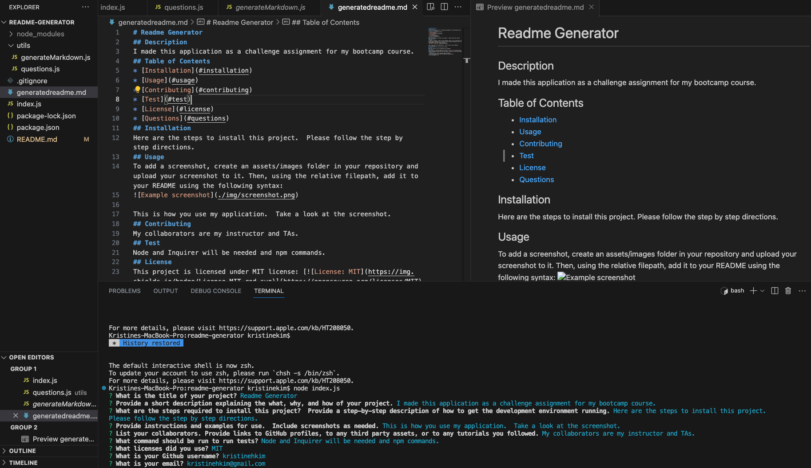

# Readme Generator
> This README generator is so the user can easily and quickly create a professional README file using a command-line application giving the project creator more time to devote to working on the project.
> Video demonstration [_here_](https://drive.google.com/file/d/1nuTFrsrxFprEZKNy_JPYGSRvRQCYY3le/view). <!-- If you have the project hosted somewhere, include the link here. -->

## Table of Contents
* [General Info](#general-information)
* [Technologies Used](#technologies-used)
* [Features](#features)
* [Screenshots](#screenshots)
* [Setup](#setup)
* [Usage](#usage)
* [Project Status](#project-status)
* [Room for Improvement](#room-for-improvement)
* [Acknowledgements](#acknowledgements)
* [Contact](#contact)
<!-- * [License](#license) -->

## General Information
This README generator is for developers to quickly create a professional README for a new project.  The application will be invoked in the command-line by using the command node index.js.  Once that command is executed, the user will be prompted with a series of questions to respond to.  After the user answers all the questions, a high-quality README will be generated.  The title of the project will be displayed at the top and there will be sections entitled Description, Table of Contents, Installation, Usage, License, Contributing, Tests, and Questions.  The Table of Contents will display as links that will guide to the corresponding section of the README.  The user's responses will be added to the sections with its appropriate title.  As part of the series of questions, the user will choose a license (or none if one wasn't used) and a badge for that license will appear in the README.  When the user enters their GitHub username and email, they will both appear as links under the section entitled Questions.
<!-- You don't have to answer all the questions - just the ones relevant to your project. -->

## Technologies Used
- Node - version 1.0
- Inquirer - version 8.2.4

## Features
List the ready features here:
- Table of Contents link the user to the correct corresponding section of the README.
- Once the user answers the questions, the responses will appear under the appropriate sections of the README.
- Once a license is chosen, a badge will be added.
- Links to the user's GitHub profile and email will be created under the section entitled Questions for anyone to reach the project creator.

## Screenshots

<!-- If you have screenshots you'd like to share, include them here. -->

## Setup
In order to use this application, Node, Inquirer 8.2.4, and the File System module are required.

## Usage
In order to invoke the command-line application, use the following command:

`node index.js`

## Project Status
Project is: _in progress_.

## Room for Improvement
Include areas you believe need improvement / could be improved. Also add TODOs for future development.

Room for improvement:
- Improvement to be done 1
- Improvement to be done 2

To do:
- Feature to be added 1
- Feature to be added 2

## Acknowledgements
- Many thanks to my instructor, Michael Pacheco, the TAs, Nirav and Julius, and my tutor Dane Shrewsbury.

## Contact
Created by Kristine Kim.  Feel free to contact me at kristinehkim@gmail.com!

<!-- Optional -->
<!-- ## License -->
<!-- This project is open source and available under the [... License](). -->

<!-- You don't have to include all sections - just the one's relevant to your project -->